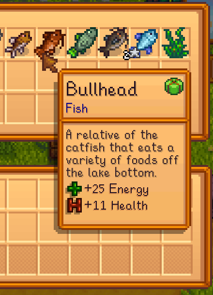
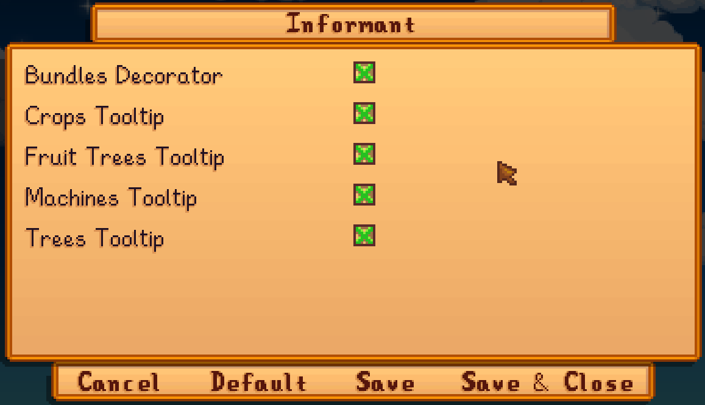

# Informant

_A Mod for Stardew Valley_

[](LICENSE)

- **Author:** [Stef Schulz](mailto:s.schulz@slothsoft.de)
- **Repository:** <https://github.com/slothsoft/stardew-informant>
- **Open Issues:** <https://github.com/slothsoft/stardew-informant/issues>

A mod that displays additional information on various objects.
It marks inventory items that are still necessary for the bundle, calculates how many days are still left until the
harvest and displays what is in a machine and how much time is left on it.



**Content of this ReadMe:**

- **[User Manual](#user-manual)**
  - [Prerequisites](#prerequisites)
  - [Installing](#installing)
  - [Using the Mod](#using-the-mod)
  - [Configuration](#configuration)
  - [Versions](#versions)
- **[Translator Guide](#translator-guide)**
- **[Developer Notes](#developer-notes)**
- **[License](#license)**


## User Manual

### Prerequisites

You need **[SMAPI](https://smapi.io/)** to run any kind of mods. And of course you need 
**[Stardew Valley](https://www.stardewvalley.net/)**.


### Installing

1. Install [SMAPI](https://smapi.io/)
1. Unzip the latest _[Informant.zip](https://github.com/slothsoft/stardew-informant/releases/latest)_ to the _Mods/_ folder
1. If you want to use spacechase0's [Generic Mod Config Menu](https://www.nexusmods.com/stardewvalley/mods/5098), this mod automatically hooks into its menu


### Using the Mod

The mod is automatically present in the game. 
You just need to move the mouse over the object you wish to get the information from.


### Configuration

If you wish to configure this mod, it's advised to install spacechase0's
[Generic Mod Config Menu](https://www.nexusmods.com/stardewvalley/mods/5098). Then there will be a config
page.



But if you wish to change the _config.json_ file manually, you can also do that. The _config.json_ with all
entries is:

```json
{
  "DisplayIds": {
    "bundles": true,
    "crop": true,
    "fruit-tree": true,
    "machine": true,
    "tree": true
  }
}
```

| Key in JSON             | Config Name         | Default Value | Explanation                                         |
|-------------------------|---------------------|---------------|-----------------------------------------------------|
| `DisplayIds.bundles`    | Bundles Decorator   | `true`        | True if the bundle decorator should be activated    |
| `DisplayIds.crop`       | Crops Tooltip       | `true`        | True if the crops tooltip should be activated       |
| `DisplayIds.fruit-tree` | Fruit Trees Tooltip | `true`        | True if the fruit trees tooltip should be activated |
| `DisplayIds.machine`    | Machines Tooltip    | `true`        | True if the machines tooltip should be activated    |
| `DisplayIds.tree`       | Trees Tooltip       | `true`        | True if the trees tooltip should be activated       |


### Versions

| Version | Issues                                                                        | Changes                   |
|---------|-------------------------------------------------------------------------------|---------------------------|
| Future  | [Issues](https://github.com/slothsoft/stardew-informant/milestone/1)          |                           |
| 0.4.0   | [Issues](https://github.com/slothsoft/stardew-informant/milestone/3?closed=1) | Prepare for Nexus Release |
| 0.3.0   | [Issues](https://github.com/slothsoft/stardew-informant/milestone/2?closed=1) | Strutured PoC             |
| 0.2.0   | -                                                                             | Crop Informant            |
| 0.1.0   | -                                                                             | Bundle Informant          |

_(All issues can be found [here](https://github.com/slothsoft/stardew-informant/issues).)_


## Translator Guide

Right now, not all translations are provided. If you want to help, translate either file in the _[i18n/](Informant/i18n/)_
and test it right in your Stardew Valley (the same folder exists in your _Mods/_ folder). You can than provide it
to me via [pull request](https://github.com/slothsoft/stardew-informant/fork) or [email](mailto:s.schulz@slothsoft.de).

| Key       | Language  | Translated? |
|-----------|-----------|-------------|
| `default` | English   |  ✅  |
| `de`      | German    |  ✅  |
| `es`      | Spanish   |             |
| `fr`      | French    |             |
| `hu`      | Hungarian |             |
| `it`      | Italian   |             |
| `ko`      | Korean    |             |
| `pt`      | Portugese |             |
| `ru`      | Russian   |             |
| `tr`      | Turkish   |             |
| `zh`      | Chinese   |             |


## Developer Notes

_(This section contains notes to myself.)_

### Starting Development

To start developing this mod, you need to

1. Create [stardewvalley.targets](https://github.com/Pathoschild/SMAPI/blob/develop/docs/technical/mod-package.md#custom-game-path) file with the game folder


### Release

1. Check that all the versions are correct (see point 5)
2. Run _build.bat_, which only really works on my PC, but so what:
```bat
.\build x.x.x
```
3. Put the contents of _bin/Informant*.zip_ in a fresh Stardew Valley and test if everything works (see [Test Plan](#test-plan))
4. Create a new tag and release on GitHub, append the ZIPs
5. Increment the version in _manifest.json_ and _build/common.targets_


### Used Tutorials

- **General Information:**
  - SMAPI API: [Modding:Modder Guide/APIs](https://stardewvalleywiki.com/Modding:Modder_Guide/APIs)
  - Stardew Valley API: [StawdewValley on GitHub](https://github.com/veywrn/StardewValley)


## License

This project is licensed under the MIT License - see the [MIT license](LICENSE) for details.